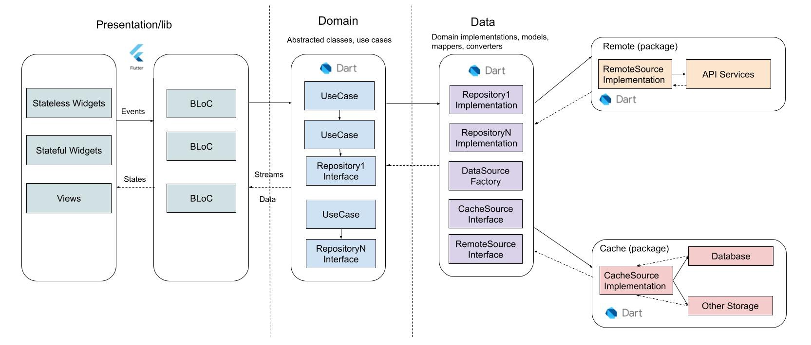

# Flutter Pokemon App

Flutter app using clean architecture and BLoC pattern.

## Using on this app

- Clean Architecture
- sqflite
- go_route
- Flutter Riverpod
- Mockito test
- [PokeApi](https://pokeapi.co/)

## Clean Architecture Diagram



## Folder Structure
```
└── 📁lib
    └── 📁l10n
        ├── app_localizations_en.dart
        ├── app_localizations_es.dart
        ├── app_localizations.dart
        ├── intl_en.arb
        ├── intl_es.arb
    └── 📁src
        └── 📁config
            └── 📁router
                ├── router.dart
            └── 📁utils
                ├── constants.dart
                ├── custom_shape_border.dart
                ├── images.dart
                ├── sprites.dart
            ├── themes.dart
        └── 📁core
            └── 📁connections
                ├── db_provider.dart
                ├── network_connectivity.dart
            └── 📁errors
                ├── exceptions.dart
                ├── failure.dart
            └── 📁network
                ├── client_service.dart
            ├── providers.dart
        └── 📁data
            └── 📁datasources
                ├── local_data_source.dart
                ├── remote_data_source.dart
            ├── providers.dart
        └── 📁domain
            └── 📁models
                ├── pokemon.dart
                ├── sprite.dart
            └── 📁repositories
                ├── pokemon_repository.dart
            └── 📁usecases
                └── 📁pokemon
                    ├── pokemon_use_case.dart
            ├── providers.dart
        └── 📁infrastructure
            └── 📁adapters
                └── 📁api
                    ├── pokemon_api.dart
                └── 📁firebase
                    ├── pokemon_firebase.dart
        └── 📁presentation
            └── 📁pages
                └── 📁details
                    └── 📁widgets
                        ├── body.dart
                    ├── details_page.dart
                └── 📁error
                    ├── error_page.dart
                └── 📁home
                    └── 📁widgets
                        ├── pokemon_card_skeleton.dart
                        ├── pokemon_card.dart
                    ├── home_page.dart
                └── 📁login
                    ├── login_page.dart
            └── 📁providers
                └── 📁pokemon
                    ├── pokemon_provider.dart
            └── 📁widgets
                ├── connection_status.dart
                ├── loading.dart
            ├── my_app.dart
    └── main.dart
```
 